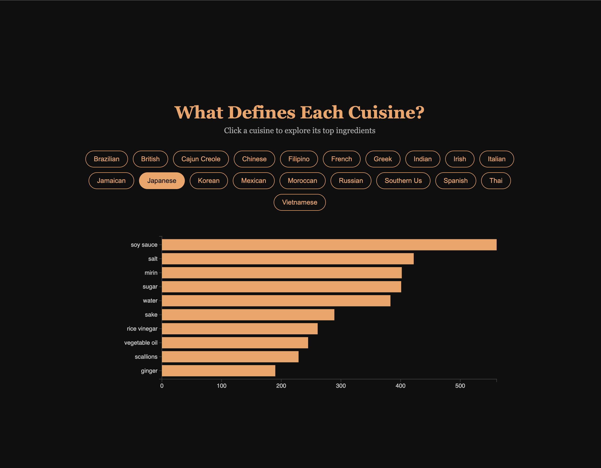

# 🌎 Global Food Explorer

A scroll-driven, interactive data story built with D3.js — exploring global cuisines, signature ingredients, real dish photography, and the surprising connections between food cultures worldwide.

**Live demo:** [https://shrihan245.github.io/global-food-explorer/](https://shrihan245.github.io/global-food-explorer/)



## What It Does

| Section | Description |
|---|---|
| Cuisines | Animated bar chart ranking 20 world cuisines by recipe count |
| Ingredients | Interactive explorer — click any cuisine to see its top 10 ingredients |
| Photo Gallery | Real dish photos from a personal collection of ~13,800 images across 6 cuisines, with a click-to-enlarge lightbox |
| Connections | Horizontal bar chart revealing ingredients shared across the most cuisines |

## Tech Stack

- **Data processing** — Python 3, pandas
- **Visualization** — D3.js v7
- **Scroll interactions** — Scrollama.js
- **Frontend** — Vanilla HTML5, CSS3, JavaScript
- **Dev tools** — Git, GitHub, GitHub Pages

No frameworks. No React. No external image APIs. Built from scratch with D3 and vanilla JS.

## Features

- Animated bar chart with hover tooltips showing cuisine name and recipe count
- 20 interactive cuisine buttons — each updates the ingredient chart dynamically
- Scroll-driven layout with smooth section transitions
- Real dish photo gallery sampled from a self-collected dataset of ~13,800 images, with a cuisine filter and lightbox viewer
- Shared ingredients analysis — shows what connects cuisines across the globe
- Fully deployed as a static site via GitHub Pages, no backend required

## Data Sources

**Recipe/ingredient data:** [Kaggle — Recipe Ingredients Dataset](https://www.kaggle.com/datasets/kaggle/recipe-ingredients-dataset)

39,774 recipes across 20 cuisines, preprocessed with pandas into three JSON files:
- `cuisine_counts.json` — recipe count per cuisine
- `top_ingredients.json` — top 10 ingredients per cuisine
- `shared_ingredients.json` — ingredients appearing across the most cuisines

**Photo data:** a personal collection of ~13,800 dish photographs organized into 6 broad cuisine categories (American, Chinese, European, Indian, Japanese, Korean). Note this uses a coarser categorization than the 20-cuisine recipe dataset above — the two run as separate, complementary sections rather than being forced into a 1:1 mapping. A small script randomly samples a handful of photos per cuisine into a lightweight manifest (`gallery_photos.json`) so the page only loads a manageable subset, not all 13,800 images at once.

## Project Structure
```
global-food-explorer/
├── index.html                    # Main page (D3 visualizations + photo gallery)
├── style.css                     # Full custom stylesheet
├── main.js                       # D3.js + Scrollama + gallery/lightbox logic
├── data/
│   ├── raw/
│   │   ├── train.json            # Original Kaggle recipe dataset
│   │   └── Dishes/                # ~13,800 dish photos, 6 cuisine folders
│   └── processed/
│       ├── cuisine_counts.json
│       ├── top_ingredients.json
│       ├── shared_ingredients.json
│       └── gallery_photos.json   # Sampled photo manifest for the gallery
└── src/
    ├── preprocess.py             # pandas preprocessing for recipe data
    └── generate_gallery.py       # Samples photos into gallery_photos.json
```

## Run Locally
```bash
# 1. Clone the repo
git clone https://github.com/Shrihan245/global-food-explorer.git
cd global-food-explorer

# 2. Set up Python environment
python3 -m venv venv
source venv/bin/activate

# 3. Install dependencies
pip install pandas

# 4. Run preprocessing (optional — processed files already included)
python3 src/preprocess.py
python3 src/generate_gallery.py

# 5. Start local server
python3 -m http.server 8000
```

Open `http://localhost:8000` in your browser.

## What I Learned

- D3.js scales, axes, and SVG rendering from scratch
- Animated transitions and enter/update/exit patterns in D3
- `d3.group()` for reshaping flat data into grouped structures on the fly
- Scroll-driven storytelling with Scrollama.js
- Data preprocessing and JSON export with pandas
- Working with a large real-world image dataset — sampling a manageable subset instead of loading everything at once
- Building a lightbox/modal image viewer in vanilla JS
- Deploying a static site with GitHub Pages
- Structuring a data pipeline: raw data → processed JSON → visualization
- Recognizing and remediating an exposed API key in git history — revoking the credential and removing the code that used it

## Roadmap

- Fix hover tooltips on bar charts
- Add world map showing cuisine origins
- Ingredient overlap network diagram (force-directed graph)
- Mobile responsive layout
- Add more cuisines from extended dataset
- Explore training an image classifier on the dish photo dataset (the ~13,800 photos are organized by cuisine, structured for exactly this)

## Author

Shrihan Bodapati — Built as a portfolio project to learn D3.js and data visualization through the lens of global food culture.

[GitHub](https://github.com/Shrihan245) · [LinkedIn](https://www.linkedin.com/in/shrihan-bodapati)